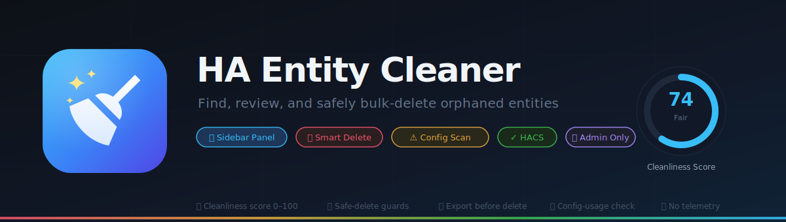
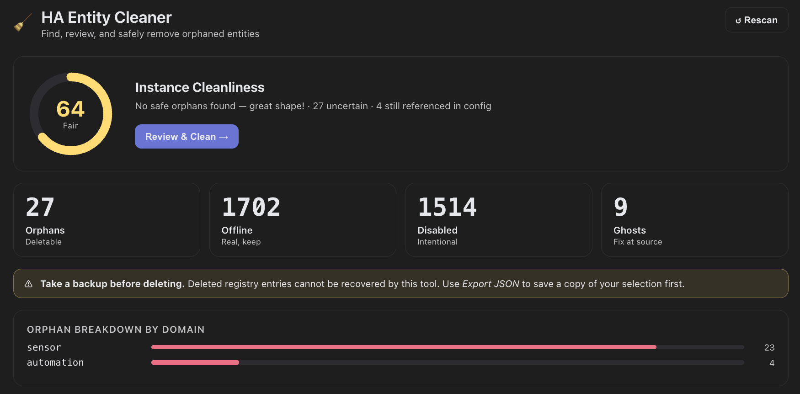
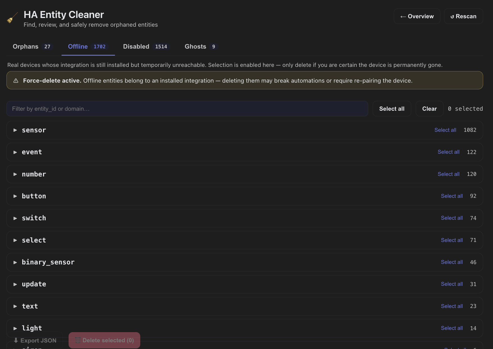
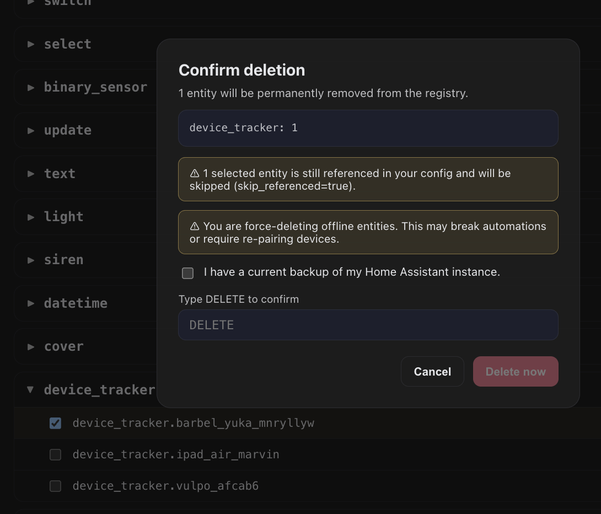
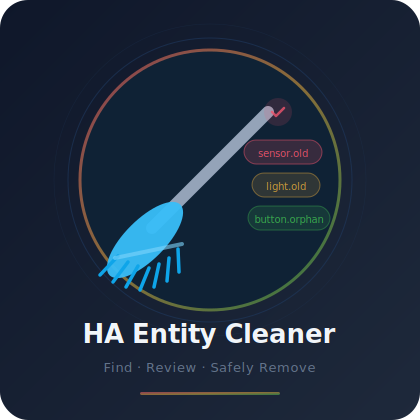

<div align="center">



<br/>

[![HACS Custom][hacs-badge]][hacs-link]
[![hassfest][hassfest-badge]][hassfest-link]
[![CodeQL][codeql-badge]][codeql-link]
[![GitHub release][release-badge]][release-link]
[![License: MIT][license-badge]](LICENSE)

**Find, review, and safely bulk-delete orphaned ("zombie") entities in Home Assistant.**  
A built-in sidebar panel, a config-usage reference check, smart-delete guards, and a cleanliness score — all local, no telemetry.

</div>

---

## Overview

Home Assistant accumulates "zombie" entities — registry leftovers from removed integrations, device migrations, or renamed devices. The native entities screen can't bulk-delete by category.

**HA Entity Cleaner** gives you a dedicated panel to:

| Feature | Description |
|---------|-------------|
| 🎯 **Cleanliness score** | 0–100 score for your instance with a per-domain breakdown |
| 🗂 **Smart classification** | Orphan (safe / uncertain), offline, disabled, ghost — with human-readable reasons |
| 🔍 **Config-usage check** | Flags entities still referenced in YAML or Lovelace dashboards before you can delete them |
| 🗑 **Smart delete** | Dry-run by default · skip-referenced on · min-age filter · per-entity error reporting |
| ⚠️ **Force-delete** | Optionally delete offline or disabled entities with explicit opt-in flags and safety warnings |
| 📋 **Export first** | Export your selection as JSON before any deletion |
| ⚙️ **Ignore rules** | Exclude by entity_id wildcard, HA label, or file glob |
| 🔒 **Admin-only** | Panel and all WS commands require admin access |
| 🤖 **Automation service** | `ha_entity_cleaner.delete_orphans` for scripted cleanup |

---

## Screenshots

### Overview — cleanliness score & counters



The home screen shows your instance's **cleanliness score** (0–100), a breakdown of entity counts by bucket, and a per-domain bar chart of orphans.

---

### Triage — review orphans grouped by domain



Switch to triage mode to review entities grouped by domain across four tabs — **Orphans**, **Offline**, **Disabled**, and **Ghosts**. Each row shows:
- ✅ Checkbox for selection (pre-checked for safe orphans, never for referenced ones)
- The entity_id and the reason it was classified
- Green = high-confidence (config entry removed), amber = uncertain (review before deleting)
- **⚠ in config** badge for entities still found in your YAML or Lovelace dashboards
- Last activity age

Offline and disabled entities can be force-deleted from their tabs, with a prominent warning banner.

---

### Delete confirmation — multi-step safe-delete flow



Before anything is deleted you must:
1. Review the entity list by domain
2. Check **"I have a current backup"**
3. Type **`DELETE`** to unlock the button

Referenced entities are listed with the exact file/dashboard location they were found in, and are automatically skipped even if selected. Force-deleting offline or disabled entities shows an extra warning. Per-entity errors are reported after the operation — nothing is silently dropped.

---

## Logo

<div align="center">

</div>

---

## How entities are classified

The decisive signal is **whether the integration that created the entity still exists** — not whether the device is reachable right now.

| Bucket | Meaning | Deletable |
|--------|---------|-----------|
| **orphan · safe** | Config entry removed, or integration no longer loaded | Yes |
| **orphan · uncertain** | No config entry; source unclear — review before deleting | Only with `include_uncertain: true` |
| **offline** | Config entry still present; device temporarily unreachable | Only with `include_offline: true` ⚠️ |
| **disabled** | Explicitly disabled in the registry | Only with `include_disabled: true` ⚠️ |
| **ghost** | State machine entry with no registry entry (YAML / MQTT) | No — fix at source |

> **⚠️ Force-delete warning:** `include_offline` and `include_disabled` require explicit opt-in. Offline entities belong to a live integration — deleting them may break automations or require re-pairing hardware. The panel shows a prominent warning banner and confirmation prompt before proceeding.

> **A WLED light that is unplugged is "offline", never an orphan.** Its config entry still exists, so HA Entity Cleaner will not touch it unless you explicitly enable `include_offline`.

### Config-usage check (Watchman-inspired)

Before any orphan is shown as selectable, HA Entity Cleaner runs a heuristic line-based scan of your YAML config tree and `.storage/lovelace*` blobs. Entities still found there are:
- Flagged with a **⚠ in config** badge
- **Never pre-selected**
- Skipped by default (`skip_referenced: true`)

> **This scan is advisory.** It is regex / heuristic-based and may produce false positives or negatives. It never causes automatic deletions and is never the sole reason an entity is skipped without your input.

---

## Installation

### HACS (recommended)

1. Open HACS → three-dot menu → **Custom repositories**
2. Add `https://github.com/marvin-rse/ha-entity-cleaner`, category **Integration**
3. Install **HA Entity Cleaner** and restart Home Assistant
4. **Settings → Devices & Services → Add Integration** → search *HA Entity Cleaner*

The sidebar panel appears automatically after setup (admin users only).

### Manual

1. Download the [latest release](https://github.com/marvin-rse/ha-entity-cleaner/releases/latest)
2. Copy `custom_components/ha_entity_cleaner/` to your HA `custom_components/` folder
3. Restart Home Assistant
4. Add the integration via Settings → Devices & Services

### Minimum requirements

| Requirement | Version |
|-------------|---------|
| Home Assistant | 2024.10.0+ |
| Python | 3.12+ |

---

## Ignore rules

In the integration's **Configure** dialog (Settings → Devices & Services → HA Entity Cleaner → Configure):

| Rule | Format | Effect |
|------|--------|--------|
| **Ignore entity IDs** | Comma-separated, wildcards OK: `sensor.old_*, light.removed` | Entity excluded from all buckets |
| **Ignore labels** | Comma-separated label names: `ignore_cleaner` | Entities with this label excluded |
| **Ignore files** | Glob patterns: `integrations/legacy/*.yaml` | File skipped in reference scan |

---

## Sensor

`sensor.ha_entity_cleaner` — state = total orphan count.

| Attribute | Description |
|-----------|-------------|
| `cleanliness_score` | 0–100 score |
| `orphan_count` | Total orphans |
| `orphan_safe_count` | High-confidence, safe to delete |
| `orphan_uncertain_count` | Uncertain, review before deleting |
| `orphan_referenced_count` | Orphans still found in config |
| `offline_count` | Offline real devices |
| `disabled_count` | Disabled entities |
| `ghost_count` | Ghost entities |
| `orphan_per_domain` | `{"button": 22, "sensor": 4}` |
| `orphan_safe_entities` | List of safe entity IDs (capped at 100) |

### Dashboard card

```yaml
type: markdown
content: >
  
  ## 🧹 Score: {{ state_attr(e, 'cleanliness_score') }}/100

  **{{ state_attr(e, 'orphan_safe_count') }}** safe orphans ready to delete
  · **{{ state_attr(e, 'orphan_uncertain_count') }}** uncertain

  
  - **{{ dom }}**: {{ n }}
  
```

---

## Services

### `ha_entity_cleaner.scan`
Re-scan and refresh counts immediately.

### `ha_entity_cleaner.delete_orphans`
Delete orphaned entities. **Always dry-run by default.**

```yaml
# Preview what would be removed (nothing deleted):
action: ha_entity_cleaner.delete_orphans
data:
  dry_run: true
response_variable: result
```

```yaml
# Delete safe orphans in the button domain older than 30 days:
action: ha_entity_cleaner.delete_orphans
data:
  dry_run: false
  domains:
    - button
  min_age_days: 30
  skip_referenced: true
response_variable: result
```

```yaml
# Force-delete offline entities (use with caution — take a backup first):
action: ha_entity_cleaner.delete_orphans
data:
  dry_run: false
  include_offline: true
  entity_ids:
    - sensor.old_device_temperature
response_variable: result
```

**Service parameters:**

| Parameter | Default | Description |
|-----------|---------|-------------|
| `dry_run` | `true` | Preview mode — nothing is deleted |
| `domains` | — | Limit to these domains |
| `entity_ids` | — | Explicit list of entity IDs |
| `include_uncertain` | `false` | Include uncertain orphans |
| `include_offline` | `false` | ⚠️ Force-delete offline entities |
| `include_disabled` | `false` | ⚠️ Force-delete disabled entities |
| `min_age_days` | `0` | Skip entities changed within this many days |
| `skip_referenced` | `true` | Skip entities still referenced in config |

**Response fields:** `matched`, `matched_count`, `deleted`, `deleted_count`, `failed`, `skipped_recent`, `skipped_uncertain`, `skipped_referenced`.

---

## WebSocket API

All commands require admin access (`@require_admin`).

| Command | Description |
|---------|-------------|
| `ha_entity_cleaner/scan` | Trigger immediate refresh |
| `ha_entity_cleaner/list` | Returns `{buckets, summary}` with score |
| `ha_entity_cleaner/delete` | Delete with guards: `entity_ids`, `include_uncertain`, `include_offline`, `include_disabled`, `min_age_days`, `skip_referenced`, `dry_run` |

---

## Safety

- **Default dry-run** — nothing is ever deleted without explicit opt-in
- **Offline/disabled protected by default** — require explicit `include_offline: true` / `include_disabled: true` to touch them; panel shows a force-delete warning
- **Referenced entities skipped** — `skip_referenced: true` by default
- **Two-factor confirmation** — typed `DELETE` + backup checkbox in the panel
- **Admin-only** — panel (`require_admin: True`) and all WS commands are inaccessible to regular users
- **Fully local** — no telemetry, no cloud, no CDN dependencies
- **Per-entity error handling** — failures are reported, never silently swallowed

---

## Security

Security issues should be reported privately. See [SECURITY.md](SECURITY.md).

This repository has:
- Branch protection on `main` (PR required, no force-push)
- Required CI checks (hassfest, HACS, pytest 3.12 & 3.13)
- CodeQL analysis (Python + JavaScript)
- Dependabot for pip, npm, and GitHub Actions
- Action SHAs pinned for supply-chain safety

---

## Development

```bash
# Backend tests
pip install pytest pytest-asyncio pytest-homeassistant-custom-component
pytest tests/ -v

# Frontend (requires Node.js 18+)
cd frontend
npm install
npm run build
# Outputs: custom_components/ha_entity_cleaner/www/ha-entity-cleaner.js
```

CI runs automatically on push and PR: hassfest → HACS validation → pytest (3.12 + 3.13).

---

## Disclaimer

Community project, not affiliated with the Home Assistant project. Classification uses the entity registry, config entries, and live states — verify against your own setup before bulk deleting. The config-usage scan is heuristic and may produce false positives. **Always take a backup before deleting.** Portions developed with AI assistance.

## License

MIT — see [LICENSE](LICENSE).

[hacs-badge]: https://img.shields.io/badge/HACS-Custom-orange.svg
[hacs-link]: https://hacs.xyz
[hassfest-badge]: https://github.com/marvin-rse/ha-entity-cleaner/actions/workflows/validate.yml/badge.svg
[hassfest-link]: https://github.com/marvin-rse/ha-entity-cleaner/actions/workflows/validate.yml
[codeql-badge]: https://github.com/marvin-rse/ha-entity-cleaner/actions/workflows/codeql.yml/badge.svg
[codeql-link]: https://github.com/marvin-rse/ha-entity-cleaner/actions/workflows/codeql.yml
[release-badge]: https://img.shields.io/github/v/release/marvin-rse/ha-entity-cleaner
[release-link]: https://github.com/marvin-rse/ha-entity-cleaner/releases
[license-badge]: https://img.shields.io/badge/License-MIT-yellow.svg
